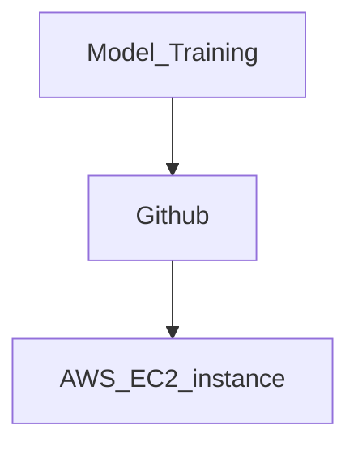

# ThreatFabric_MLOPS_Challenge

This repo is for the ThreatFabric_MLOPS_Challenge

## Task 1.

The first task is Modle building and as required to be build in Jupyter notebook so Challange.ipynb notebook has all the code and required explanation.

## Task 2.

### Option1:

### Deploying to AWS EC2

Log into your AWS account and create an EC2 instance (`t2.micro`), using the latest stable
Ubuntu Linux AMI.

[SSH into the instance](https://aws.amazon.com/blogs/compute/new-using-amazon-ec2-instance-connect-for-ssh-access-to-your-ec2-instances/) and run these commands to update the software repository and install
our dependencies.

```bash
sudo apt-get update
sudo apt install -y python3-pip nginx
```

Clone the FastAPI server app (or create your `main.py` in Python).

```bash
git clone https://github.com/rizwanishaq/challange-threatfit.git
cd challange-threatfit/
pip3 install -r requirements.txt
```

As the models are small so we can train from scratch using the following commands or copy the models to challange-threatfit.

So train the model for this particular task we can use this ec2-instance using the following command:

```bash
python3 train_model.py
```

we will have model with following names svm.joblib, rf_clf.joblib and xgb_clf.joblib.

After this we need to serve the model using the follow settings.

Add the FastAPI configuration to NGINX's folder. Create a file called `fastapi_nginx` (like the one in this repository).

```bash
sudo nano /etc/nginx/sites-enabled/fastapi_nginx
```

And put this config into the file (replace the IP address with your EC2 instance's public IP):

```
server {
    listen 80;
    server_name <YOUR_EC2_IP>;
    location / {
        proxy_pass http://127.0.0.1:8000;
    }
}
```

Start NGINX.

```bash
sudo service nginx restart
```

Start FastAPI.

```bash
cd fastapi-tutorial
python3 -m uvicorn main:app
```

Update EC2 security-group settings for your instance to allow HTTP traffic to port 80.

Now when you visit your public IP of the instance, you should be able to access your API.

## Option 2:

### Deploying FastAPI to AWS Lambda

Tried this method but failed due the size of the lambda_function.zip file, as AWS Lambda does not allows the zip files greater than 250MB. So only tested this option and trying to find a way to reduce the size, until now tried but failed.

But I followed the following steps for this task.

We'll need to modify the API so that it has a Lambda handler. Use Mangum:

```python
from mangum import Mangum

app = FastAPI()
handler = Mangum(app)
```

We'll also need to install the dependencies into a local directory so we can zip it up.

```bash
pip install -t lib -r requirements.txt
```

We now need to zip it up.

```bash
(cd lib; zip ../lambda_function.zip -r .)
```

Now add our FastAPI file and the JSON file.

```bash
zip lambda_function.zip -u main.py
zip lambda_function.zip -u rf_clf.joblib
zip lambda_function.zip -u svm.joblib
zip lambda_function.zip -u xgb_clf.joblib
```

# Flow Diagram


